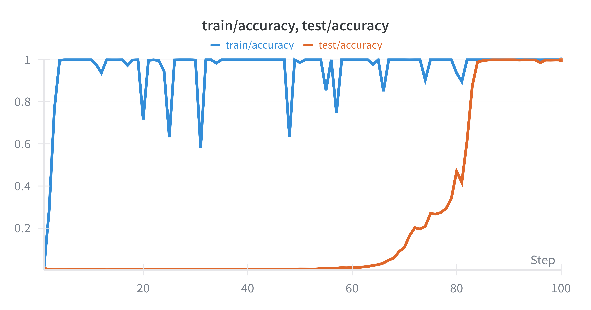
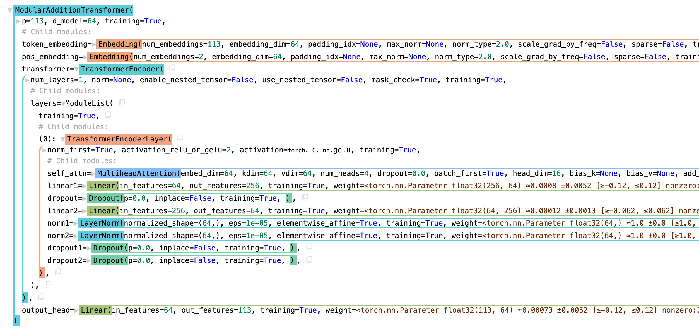

# grokking modular addition 

<div align="center">
  
  <br>
  <em>Fig. 1 - Train and test accuracy over epochs; each step is 100 epochs. Training reaches 100% quickly, while test accuracy stays near 0 until ~6000 epochs before rising to 100%. Train sample size: 2553; Test sample size: 10216; Model parameters: 64,689.</em>
</div>


This project aims to reproduce "grokking" phenomenon in modular addition task, viz. $(a,b)\mapsto (a+b) \mod 113$, using the following 1-layer transformer model.

<div align="center">
  
  <br>
  <em>Fig. 2 - Model architecture visualized using <a href="https://github.com/google-deepmind/treescope">Treescope</a>.</em>
</div>


Note that we do not use causal attention; it is not a `seq2seq` model.


# Reproduce 

1. Install `uv`.
2. Clone this repo and `cd` into it. Setup environment using `uv sync`.
3. (Optional) Setup `wandb` using `uv run wandb login`.
4. Check the available config options using `uv run run.py -h`.
4. Run the following command: 
    ```bash
    uv run run.py --p=113 --train_frac=0.20 --lr=1e-3 --epochs=30_000 --weight_decay=1.0
    ```

# Note 
- `weight_decay` is a key parameter to induce grokking: after the model reaches a "memorization basin" where the gradient loss term become negligible, the only signal is from the regularization term, say $\lambda\|\cdot\|^2$ which pushes the learned parameter to be in a closed ball centred at zero with radius inversely proportional to $\lambda$; larger the $\lambda$, stronger is this signal, and ideally it moves the parameter to a "generalization basin".
